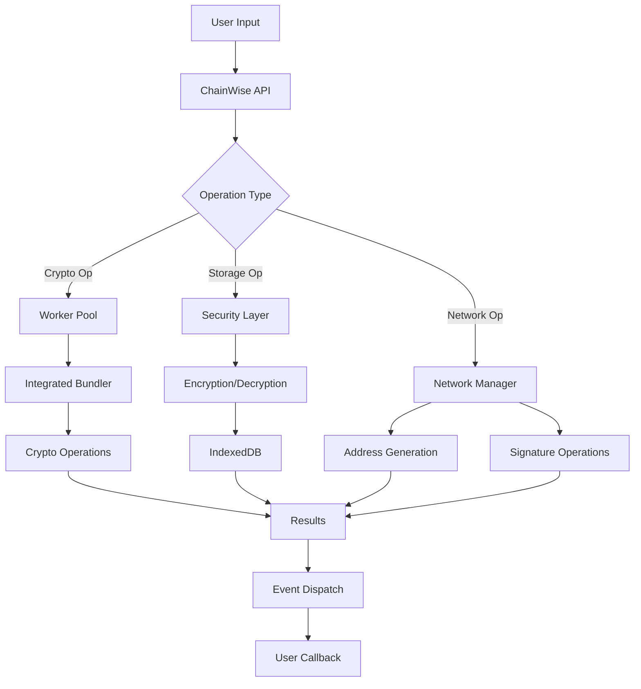

# ChainWise Development Guide

<div align="center">

**Advanced Implementation & Development Patterns**

[](https://github.com/chainwise/chainwise)
[](https://chainwise.dev/api)

</div>

## 📋 Table of Contents

- [Architecture Overview](#architecture-overview)
- [Advanced Implementation](#advanced-implementation)
- [Custom Network Integration](#custom-network-integration)
- [Performance Optimization](#performance-optimization)
- [Security Implementation](#security-implementation)
- [Testing & Debugging](#testing--debugging)
- [Production Deployment](#production-deployment)
- [API Reference](#api-reference)

## 🏗️ Architecture Overview

### Core Components

```
ChainWise Architecture
├── Core Wallet (CryptoWallet)
│   ├── HD Wallet Management (BIP32/BIP44)
│   ├── Key Derivation & Storage
│   ├── Network Configuration Manager
│   └── Event System
├── Integrated CryptoBundler
│   ├── Multi-Curve Support (secp256k1, ed25519, sr25519)
│   ├── Hash Functions (SHA256, Blake2b, Keccak256, RIPEMD160)
│   ├── Encoding (Base58, Base32, Bech32)
│   └── Signature Generation & Verification
├── Worker Pool Manager
│   ├── Task Queue Management
│   ├── Parallel Processing
│   ├── Error Handling & Recovery
│   └── Performance Monitoring
└── Storage & Security Layer
    ├── AES-256-GCM Encryption
    ├── PBKDF2 Key Derivation
    ├── IndexedDB Integration
    └── Memory Management
```

### Data Flow



## 🔐 Key Derivation & Storage Architecture

ChainWise implements a comprehensive key derivation and storage system that supports multiple cryptographic curves and follows industry standards for security and compatibility.

### Core Key Derivation System

#### BIP32/BIP44 Hierarchical Deterministic (HD) Wallets

```javascript
// Master Key Generation from Entropy
class WorkerBIP32HDWallet {
    constructor(seed) {
        this.seed = seed;
        this.masterKey = this._generateMasterKey(seed);
    }

    _generateMasterKey(seed) {
        // Uses HMAC-SHA512 with "Bitcoin seed" as key
        const hmac = CryptoJS.HmacSHA512(
            CryptoJS.enc.Hex.parse(WorkerCryptoUtils.bytesToHex(seed)),
            CryptoJS.enc.Utf8.parse('Bitcoin seed')
        );
        
        const hmacBytes = WorkerCryptoUtils.hexToBytes(hmac.toString());
        return {
            privateKey: hmacBytes.slice(0, 32),    // First 32 bytes
            chainCode: hmacBytes.slice(32, 64),    // Last 32 bytes
            depth: 0,
            parentFingerprint: new Uint8Array(4),
            childIndex: 0
        };
    }
}
```

#### Multi-Curve Key Derivation

ChainWise supports three primary cryptographic curves:

##### 1. secp256k1 (Bitcoin, Ethereum, etc.)
```javascript
deriveBIP44Key(coinType, account = 0, change = 0, addressIndex = 0) {
    let key = this.masterKey;
    
    // Standard BIP44 path: m/44'/coinType'/account'/change/addressIndex
    key = this.deriveChild(key, 44, true);        // m/44'
    key = this.deriveChild(key, coinType, true);  // m/44'/coinType'
    key = this.deriveChild(key, account, true);   // m/44'/coinType'/account'
    key = this.deriveChild(key, change, false);   // m/44'/coinType'/account'/change
    key = this.deriveChild(key, addressIndex, false); // m/44'/coinType'/account'/change/addressIndex
    
    return key;
}

deriveChild(parentKey, index, hardened = false) {
    const hardenedOffset = 0x80000000;
    const childIndex = hardened ? index + hardenedOffset : index;
    
    // Create derivation data
    let data;
    if (hardened) {
        // Hardened derivation uses private key
        data = new Uint8Array(37);
        data.set([0], 0); // 0x00 prefix
        data.set(parentKey.privateKey, 1);
    } else {
        // Non-hardened uses public key
        const publicKey = secp256k1.keyFromPrivate(parentKey.privateKey)
            .getPublic().encode('array', true);
        data = new Uint8Array(37);
        data.set(publicKey, 0);
    }
    
    // Add child index (big endian)
    const view = new DataView(data.buffer);
    view.setUint32(33, childIndex, false);
    
    // HMAC-SHA512(chainCode, data)
    const hmac = CryptoJS.HmacSHA512(
        CryptoJS.enc.Hex.parse(WorkerCryptoUtils.bytesToHex(data)),
        CryptoJS.enc.Hex.parse(WorkerCryptoUtils.bytesToHex(parentKey.chainCode))
    );
    
    const hmacBytes = WorkerCryptoUtils.hexToBytes(hmac.toString());
    const childPrivateKey = hmacBytes.slice(0, 32);
    const childChainCode = hmacBytes.slice(32, 64);
    
    // Add parent private key to child private key (mod curve order)
    const parentKeyBN = secp256k1.keyFromPrivate(parentKey.privateKey).getPrivate();
    const childKeyBN = secp256k1.keyFromPrivate(childPrivateKey).getPrivate();
    const finalPrivateKey = parentKeyBN.add(childKeyBN).mod(secp256k1.curve.n);
    
    return {
        privateKey: WorkerCryptoUtils.hexToBytes(finalPrivateKey.toString(16).padStart(64, '0')),
        chainCode: childChainCode,
        depth: parentKey.depth + 1,
        parentFingerprint: await this._getFingerprint(parentKey),
        childIndex: childIndex
    };
}
```

##### 2. Ed25519 (Solana, Cardano, Stellar, etc.)
```javascript
// Ed25519 uses different derivation method
async deriveEd25519Key(coinType, account = 0, change = 0, addressIndex = 0) {
    // Create derivation path string
    const derivationPath = `m/44'/${coinType}'/${account}'/${change}/${addressIndex}`;
    
    // Combine seed with derivation path for Ed25519
    const derivationSeed = new Uint8Array([
        ...this.seed, 
        ...new TextEncoder().encode(derivationPath)
    ]);
    
    // Hash to get 32-byte seed for Ed25519
    const ed25519Seed = await WorkerCryptoUtils.sha256(derivationSeed);
    return ed25519Seed.slice(0, 32);
}
```

##### 3. Sr25519 (Polkadot, Kusama)
```javascript
// Sr25519 uses substrate-style derivation
deriveSr25519Key(coinType, account = 0) {
    const derivationPath = `//${coinType}//${account}`;
    const derivationSeed = new Uint8Array([
        ...this.seed, 
        ...new TextEncoder().encode(derivationPath)
    ]);
    
    // Use Blake2b for Substrate compatibility
    return WorkerCryptoUtils.blake2b(derivationSeed, 32);
}
```

### Network-Specific Derivation Paths

ChainWise implements standardized derivation paths for each blockchain:

```javascript
const DERIVATION_PATHS = {
    bitcoin: "m/44'/0'/0'/0/0",          // BIP44 standard
    ethereum: "m/44'/60'/0'/0/0",        // BIP44 standard
    solana: "m/44'/501'/0'/0'",          // Solana standard (hardened)
    cardano: "m/1852'/1815'/0'/0/0",     // CIP-1852 standard
    polkadot: "m/44'/354'/0'/0'/0'",     // Substrate standard
    kusama: "m/44'/434'/0'/0'/0'",       // Substrate standard
    cosmos: "m/44'/118'/0'/0/0",         // Cosmos standard
    // ... other networks
};
```

### Secure Storage Architecture

#### 1. Memory Storage (Runtime)
```javascript
class CryptoWallet {
    constructor() {
        // Secure in-memory storage
        this.hdWallet = null;              // Master wallet data
        this.derivedKeys = new Map();      // Network-specific keys
        this.addresses = new Map();        // Generated addresses
        
        // Performance caches (cleared on lock)
        this._keyCache = new Map();
        this._addressCache = new Map();
    }
}
```

#### 2. Encrypted Persistent Storage
```javascript
// AES-256-GCM encryption with PBKDF2 key derivation
async _saveToStorage(password) {
    const keyData = {
        seed: this.bytesToHex(this.hdWallet.seed),
        addresses: this.getAllAddresses(),
        timestamp: Date.now(),
        version: this.version
    };
    
    // Encrypt using worker
    const encrypted = await this._executeTask('encryptData', {
        plaintext: JSON.stringify(keyData),
        password: password
    });

    // Store in IndexedDB
    const encryptedData = {
        id: 'master',
        encrypted: encrypted.encrypted,    // AES-256-GCM encrypted data
        salt: encrypted.salt,             // Random salt for PBKDF2
        iv: encrypted.iv,                 // Random IV for AES-GCM
        timestamp: Date.now()
    };
    
    await this._storeInIndexedDB(encryptedData);
}
```

#### 3. Worker-Based Encryption
```javascript
// Secure encryption in Web Worker
const WorkerCryptoUtils = {
    async deriveKey(password, salt, iterations = 100000) {
        const encoder = new TextEncoder();
        const keyMaterial = await crypto.subtle.importKey(
            'raw',
            encoder.encode(password),
            { name: 'PBKDF2' },
            false,
            ['deriveKey']
        );

        return await crypto.subtle.deriveKey({
            name: 'PBKDF2',
            salt: salt,
            iterations: iterations,  // 100,000 iterations
            hash: 'SHA-256'
        }, keyMaterial, {
            name: 'AES-GCM', 
            length: 256
        }, false, ['encrypt', 'decrypt']);
    },
    
    async encrypt(data, password) {
        const salt = this.randomBytes(16);  // 128-bit salt
        const iv = this.randomBytes(12);    // 96-bit IV for GCM
        const key = await this.deriveKey(password, salt);
        
        const plaintext = typeof data === 'string' ? 
            new TextEncoder().encode(data) : data;
            
        const encrypted = await crypto.subtle.encrypt({
            name: 'AES-GCM',
            iv: iv
        }, key, plaintext);

        return {
            encrypted: new Uint8Array(encrypted),
            salt: salt,
            iv: iv
        };
    }
};
```

### Key Management Security Features

#### 1. Memory Protection
- **Automatic Clearing**: Keys are cleared from memory when wallet is locked
- **Cache Management**: Performance caches are regularly cleared
- **Worker Isolation**: Cryptographic operations run in isolated Web Workers

#### 2. Password Validation
```javascript
validatePassword(password) {
    const result = {
        isValid: false,
        score: 0,
        issues: []
    };

    // Enforce strong password requirements
    if (password.length < 8) {
        result.issues.push('Password must be at least 8 characters long');
    } else {
        result.score += 1;
    }

    // Check for character variety
    if (!/[a-z]/.test(password)) {
        result.issues.push('Password must contain lowercase letters');
    } else {
        result.score += 1;
    }

    if (!/[A-Z]/.test(password)) {
        result.issues.push('Password must contain uppercase letters');
    } else {
        result.score += 1;
    }

    if (!/[0-9]/.test(password)) {
        result.issues.push('Password must contain numbers');
    } else {
        result.score += 1;
    }

    if (!/[^a-zA-Z0-9]/.test(password)) {
        result.issues.push('Password must contain special characters');
    } else {
        result.score += 1;
    }

    result.isValid = result.issues.length === 0 && result.score >= 4;
    return result;
}
```

#### 3. Import/Export Security
```javascript
// Secure seed import with validation
async importSeed(seedHex, password) {
    this._validatePassword(password);
    
    // Validate seed format (64 hex characters = 32 bytes)
    if (typeof seedHex !== 'string' || !/^[0-9a-fA-F]{64}$/.test(seedHex)) {
        throw new Error('Seed must be 64 hex characters');
    }

    const seed = this.hexToBytes(seedHex);
    
    // Derive all network keys from imported seed
    const result = await this._executeTask('deriveKeysFromSeed', {
        seedData: Array.from(seed),
        networks: this.supportedNetworks
    });
    
    // Store securely
    this.hdWallet = { seed: seed, masterKey: null };
    this._convertAndStoreKeys(result.derivedKeys, result.addresses);
    
    if (this.options.autoSave) {
        await this._saveToStorage(password);
    }
}

// Secure seed export (requires unlocked wallet)
exportSeed() {
    this._requireUnlocked();
    return this.bytesToHex(this.hdWallet.seed);
}
```

### Database Schema (IndexedDB)

```javascript
// IndexedDB structure for encrypted storage
const DB_SCHEMA = {
    name: 'ChainWiseWallet',
    version: 1,
    stores: {
        encryptedKeys: {
            keyPath: 'id',
            indexes: [
                { name: 'timestamp', keyPath: 'timestamp', unique: false },
                { name: 'version', keyPath: 'version', unique: false }
            ]
        }
    }
};

// Stored data structure
const STORED_DATA_FORMAT = {
    id: 'master',                    // Primary key
    encrypted: Uint8Array,           // AES-256-GCM encrypted wallet data
    salt: Uint8Array,               // PBKDF2 salt (16 bytes)
    iv: Uint8Array,                 // AES-GCM IV (12 bytes)
    timestamp: Number,              // Creation timestamp
    version: String                 // Wallet version for migration
};
```

### Performance Optimizations

#### 1. Lazy Key Derivation
```javascript
// Keys are derived only when needed
async getNetworkKey(network) {
    // Check cache first
    if (this._keyCache.has(network)) {
        return this._keyCache.get(network);
    }
    
    // Derive if not cached
    const networkConfig = this.networks.get(network);
    const derivedKey = await this._deriveNetworkKey(networkConfig);
    
    // Cache for future use
    this._keyCache.set(network, derivedKey);
    return derivedKey;
}
```

#### 2. Worker Pool Management
```javascript
// Distribute cryptographic operations across multiple workers
async _executeTask(type, data) {
    return new Promise((resolve, reject) => {
        const availableWorker = this.workerPool.find(worker => !worker.busy);
        if (!availableWorker) {
            // Queue task if no workers available
            this.taskQueue.push({ type, data, resolve, reject });
            return;
        }
        
        this._assignTaskToWorker(availableWorker, { type, data, resolve, reject });
    });
}
```

### Security Best Practices Implementation

1. **Never store private keys in plain text**
2. **Use cryptographically secure random number generation**
3. **Implement proper key derivation with sufficient iterations**
4. **Clear sensitive data from memory when not needed**
5. **Use Web Workers for isolation**
6. **Validate all inputs and handle errors securely**


## 🚀 Advanced Implementation

### Enterprise Wallet Application

```javascript
class EnterpriseWalletManager {
    constructor() {
        this.wallet = new ChainWise({
            maxWorkers: 8,
            enableLogging: false, // Disable in production
            autoSave: true,
            defaultNetworks: null // Support all networks
        });
        
        this.sessions = new Map();
        this.auditLog = [];
        this.rateLimiter = new Map();
        
        this.setupEventHandlers();
        this.initializeMetrics();
    }

    async createUserSession(userId, password, permissions = []) {
        try {
            // Rate limiting
            if (this.isRateLimited(userId)) {
                throw new Error('Rate limit exceeded. Please try again later.');
            }

            // Initialize user-specific wallet
            const userWallet = new ChainWise({
                maxWorkers: 2,
                enableLogging: false,
                autoSave: true
            });

            await userWallet.initialize(password);
            
            const session = {
                id: this.generateSessionId(),
                userId,
                wallet: userWallet,
                permissions,
                createdAt: Date.now(),
                lastActivity: Date.now(),
                operationCount: 0
            };

            this.sessions.set(session.id, session);
            
            // Audit logging
            this.auditLog.push({
                action: 'SESSION_CREATED',
                userId,
                sessionId: session.id,
                timestamp: Date.now(),
                ip: this.getClientIP()
            });

            return {
                sessionId: session.id,
                supportedNetworks: userWallet.getSupportedNetworks(),
                addresses: userWallet.getAllAddresses()
            };

        } catch (error) {
            this.auditLog.push({
                action: 'SESSION_CREATION_FAILED',
                userId,
                error: error.message,
                timestamp: Date.now()
            });
            throw error;
        }
    }

    async executeOperation(sessionId, operation, params) {
        const session = this.validateSession(sessionId);
        
        // Check permissions
        if (!this.hasPermission(session, operation)) {
            throw new Error(`Insufficient permissions for ${operation}`);
        }

        // Update activity
        session.lastActivity = Date.now();
        session.operationCount++;

        try {
            let result;
            
            switch (operation) {
                case 'generateAddresses':
                    result = await this.generateBulkAddresses(session, params);
                    break;
                    
                case 'signMessage':
                    result = await this.signMessage(session, params);
                    break;
                    
                case 'verifySignature':
                    result = await this.verifySignature(session, params);
                    break;
                    
                case 'exportWallet':
                    result = await this.exportWallet(session, params);
                    break;
                    
                default:
                    throw new Error(`Unknown operation: ${operation}`);
            }

            // Audit successful operation
            this.auditLog.push({
                action: operation.toUpperCase(),
                userId: session.userId,
                sessionId,
                params: this.sanitizeParams(params),
                timestamp: Date.now(),
                success: true
            });

            return result;

        } catch (error) {
            // Audit failed operation
            this.auditLog.push({
                action: operation.toUpperCase(),
                userId: session.userId,
                sessionId,
                error: error.message,
                timestamp: Date.now(),
                success: false
            });
            throw error;
        }
    }

    async generateBulkAddresses(session, { network, count, addressType = 0, startIndex = 0 }) {
        if (count > 1000) {
            throw new Error('Maximum 1000 addresses per operation');
        }

        const addresses = await session.wallet.generateMultipleAddresses(
            network, 
            count, 
            addressType, 
            startIndex
        );

        // Store addresses in session for quick access
        if (!session.generatedAddresses) {
            session.generatedAddresses = {};
        }
        if (!session.generatedAddresses[network]) {
            session.generatedAddresses[network] = [];
        }
        session.generatedAddresses[network].push(...addresses);

        return {
            network,
            count: addresses.length,
            addresses: addresses.map(addr => ({
                index: addr.index,
                path: addr.path,
                address: addr.address || { legacy: addr.legacy, segwit: addr.segwit }
            })) // Remove private keys from response
        };
    }

    async signMessage(session, { message, network, addressIndex = 0 }) {
        if (!message || message.length > 10000) {
            throw new Error('Invalid message: must be 1-10000 characters');
        }

        const signature = await session.wallet.signMessage(message, network);

        return {
            message,
            network,
            signature: signature.signature,
            address: signature.address,
            algorithm: signature.curve,
            timestamp: Date.now()
        };
    }

    async verifySignature(session, { message, signature, network, publicKey }) {
        let verification;
        
        if (publicKey) {
            // External verification
            verification = await session.wallet.verifyMessageWithPublicKey(
                message, 
                signature, 
                publicKey, 
                this.getNetworkCurve(network)
            );
        } else {
            // Internal verification with wallet keys
            verification = await session.wallet.verifyMessage(message, signature, network);
        }

        return {
            isValid: verification.isValid,
            message,
            network,
            algorithm: verification.algorithm,
            verificationTime: verification.verificationTime
        };
    }

    // Session management methods
    validateSession(sessionId) {
        const session = this.sessions.get(sessionId);
        if (!session) {
            throw new Error('Invalid session');
        }

        // Check session timeout (30 minutes)
        if (Date.now() - session.lastActivity > 30 * 60 * 1000) {
            this.destroySession(sessionId);
            throw new Error('Session expired');
        }

        return session;
    }

    destroySession(sessionId) {
        const session = this.sessions.get(sessionId);
        if (session) {
            // Clean up wallet resources
            session.wallet.destroy();
            
            // Audit session destruction
            this.auditLog.push({
                action: 'SESSION_DESTROYED',
                userId: session.userId,
                sessionId,
                duration: Date.now() - session.createdAt,
                operationCount: session.operationCount,
                timestamp: Date.now()
            });
            
            this.sessions.delete(sessionId);
        }
    }

    // Utility methods
    generateSessionId() {
        return 'sess_' + Date.now() + '_' + Math.random().toString(36).substr(2, 9);
    }

    isRateLimited(userId) {
        const now = Date.now();
        const userRequests = this.rateLimiter.get(userId) || [];
        
        // Remove old requests (older than 1 hour)
        const recentRequests = userRequests.filter(time => now - time < 60 * 60 * 1000);
        
        // Allow max 10 sessions per hour per user
        if (recentRequests.length >= 10) {
            return true;
        }
        
        recentRequests.push(now);
        this.rateLimiter.set(userId, recentRequests);
        return false;
    }

    hasPermission(session, operation) {
        if (session.permissions.length === 0) return true; // No restrictions
        return session.permissions.includes(operation) || session.permissions.includes('*');
    }

    sanitizeParams(params) {
        // Remove sensitive data from audit logs
        const sanitized = { ...params };
        delete sanitized.password;
        delete sanitized.privateKey;
        delete sanitized.seed;
        return sanitized;
    }

    getNetworkCurve(network) {
        const config = this.wallet.getNetworkConfig(network);
        return config ? config.curve : 'secp256k1';
    }

    setupEventHandlers() {
        window.addEventListener('ChainWise:walletError', (event) => {
            console.error('Wallet error:', event.detail);
            // Implement error recovery or user notification
        });
    }

    initializeMetrics() {
        this.metrics = {
            totalSessions: 0,
            activeSessions: 0,
            totalOperations: 0,
            errorRate: 0,
            averageSessionDuration: 0
        };
        
        // Update metrics every minute
        setInterval(() => this.updateMetrics(), 60000);
    }

    updateMetrics() {
        this.metrics.activeSessions = this.sessions.size;
        this.metrics.totalOperations = this.auditLog.filter(log => log.success === true).length;
        
        const errors = this.auditLog.filter(log => log.success === false).length;
        this.metrics.errorRate = this.auditLog.length > 0 ? 
            (errors / this.auditLog.length) * 100 : 0;
    }

    getAuditReport(userId, startTime, endTime) {
        return this.auditLog.filter(log => 
            log.userId === userId &&
            log.timestamp >= startTime &&
            log.timestamp <= endTime
        );
    }
}
```

### Multi-User Wallet Service

```javascript
class MultiUserWalletService {
    constructor() {
        this.users = new Map();
        this.masterWallet = new ChainWise({ maxWorkers: 16 });
        this.encryptionKeys = new Map();
    }

    async createUser(userId, masterPassword, userPassword) {
        // Generate user-specific encryption key
        const userKey = await this.deriveUserKey(userId, userPassword);
        
        // Create isolated wallet instance
        const userWallet = new ChainWise({
            maxWorkers: 2,
            enableLogging: false,
            autoSave: false // Handle saving manually
        });

        await userWallet.initialize(masterPassword);
        
        // Encrypt and store user wallet data
        const walletData = await userWallet.exportWallet(masterPassword);
        const encryptedData = await this.encryptUserData(walletData, userKey);
        
        this.users.set(userId, {
            encryptedWallet: encryptedData,
            lastAccess: Date.now(),
            activeSession: null
        });

        this.encryptionKeys.set(userId, userKey);
        
        return {
            userId,
            addresses: userWallet.getAllAddresses(),
            supportedNetworks: userWallet.getSupportedNetworks().length
        };
    }

    async getUserWallet(userId, userPassword) {
        const userData = this.users.get(userId);
        if (!userData) {
            throw new Error('User not found');
        }

        // Verify user password and get encryption key
        const userKey = await this.deriveUserKey(userId, userPassword);
        
        // Decrypt wallet data
        const walletData = await this.decryptUserData(userData.encryptedWallet, userKey);
        
        // Create new wallet instance for this session
        const sessionWallet = new ChainWise({
            maxWorkers: 2,
            enableLogging: false
        });

        await sessionWallet.importWallet(walletData, userPassword);
        
        // Update user session
        userData.activeSession = {
            wallet: sessionWallet,
            startTime: Date.now()
        };
        userData.lastAccess = Date.now();

        return sessionWallet;
    }

    async deriveUserKey(userId, password) {
        // Use PBKDF2 to derive user-specific encryption key
        const encoder = new TextEncoder();
        const keyMaterial = await crypto.subtle.importKey(
            'raw',
            encoder.encode(password + userId),
            { name: 'PBKDF2' },
            false,
            ['deriveKey']
        );

        return await crypto.subtle.deriveKey(
            {
                name: 'PBKDF2',
                salt: encoder.encode(userId + 'salt'),
                iterations: 100000,
                hash: 'SHA-256'
            },
            keyMaterial,
            { name: 'AES-GCM', length: 256 },
            false,
            ['encrypt', 'decrypt']
        );
    }

    async encryptUserData(data, key) {
        const iv = crypto.getRandomValues(new Uint8Array(12));
        const encodedData = new TextEncoder().encode(JSON.stringify(data));
        
        const encrypted = await crypto.subtle.encrypt(
            { name: 'AES-GCM', iv },
            key,
            encodedData
        );

        return {
            encrypted: Array.from(new Uint8Array(encrypted)),
            iv: Array.from(iv)
        };
    }

    async decryptUserData(encryptedData, key) {
        const iv = new Uint8Array(encryptedData.iv);
        const data = new Uint8Array(encryptedData.encrypted);
        
        const decrypted = await crypto.subtle.decrypt(
            { name: 'AES-GCM', iv },
            key,
            data
        );

        const jsonString = new TextDecoder().decode(decrypted);
        return JSON.parse(jsonString);
    }

    // Cleanup inactive sessions
    cleanupSessions() {
        const now = Date.now();
        const sessionTimeout = 30 * 60 * 1000; // 30 minutes

        for (const [userId, userData] of this.users) {
            if (userData.activeSession && 
                now - userData.activeSession.startTime > sessionTimeout) {
                
                userData.activeSession.wallet.destroy();
                userData.activeSession = null;
                console.log(`Cleaned up session for user ${userId}`);
            }
        }
    }
}
```

## 🌐 Custom Network Integration

### Adding Custom Networks

```javascript
class CustomNetworkManager {
    constructor(wallet) {
        this.wallet = wallet;
        this.customNetworks = new Map();
    }

    registerCustomNetwork(networkConfig) {
        // Validate network configuration
        this.validateNetworkConfig(networkConfig);
        
        // Add to custom networks
        this.customNetworks.set(networkConfig.key, networkConfig);
        
        // Extend wallet's network support
        this.extendWalletSupport(networkConfig);
    }

    validateNetworkConfig(config) {
        const required = ['key', 'name', 'symbol', 'coinType', 'curve', 'addressFormat'];
        for (const field of required) {
            if (!config[field]) {
                throw new Error(`Missing required field: ${field}`);
            }
        }

        // Validate curve support
        const supportedCurves = ['secp256k1', 'ed25519', 'sr25519'];
        if (!supportedCurves.includes(config.curve)) {
            throw new Error(`Unsupported curve: ${config.curve}`);
        }
    }

    extendWalletSupport(networkConfig) {
        // Add custom address generator
        this.addCustomAddressGenerator(networkConfig);
        
        // Add custom signing logic if needed
        if (networkConfig.customSigning) {
            this.addCustomSigning(networkConfig);
        }
    }

    addCustomAddressGenerator(config) {
        // Example: Custom address generation for a new network
        const generator = {
            generate: async (publicKey) => {
                switch (config.addressFormat) {
                    case 'custom-base58':
                        return this.generateCustomBase58Address(publicKey, config);
                    case 'custom-bech32':
                        return this.generateCustomBech32Address(publicKey, config);
                    default:
                        throw new Error(`Unsupported address format: ${config.addressFormat}`);
                }
            }
        };

        // Register generator with wallet
        this.wallet.registerAddressGenerator(config.key, generator);
    }

    async generateCustomBase58Address(publicKey, config) {
        // Custom implementation for Base58 address generation
        const hash = await this.wallet.sha256(publicKey);
        const versionedHash = new Uint8Array([config.versionByte, ...hash.slice(0, 20)]);
        
        // Add checksum
        const checksum = await this.wallet.sha256(await this.wallet.sha256(versionedHash));
        const addressBytes = new Uint8Array([...versionedHash, ...checksum.slice(0, 4)]);
        
        return this.base58Encode(addressBytes, config.alphabet);
    }

    base58Encode(bytes, alphabet = '123456789ABCDEFGHJKLMNPQRSTUVWXYZabcdefghijkmnopqrstuvwxyz') {
        let num = 0n;
        for (let i = 0; i < bytes.length; i++) {
            num = num * 256n + BigInt(bytes[i]);
        }

        let encoded = '';
        while (num > 0) {
            encoded = alphabet[Number(num % 58n)] + encoded;
            num = num / 58n;
        }

        // Add leading zeros
        for (let i = 0; i < bytes.length && bytes[i] === 0; i++) {
            encoded = alphabet[0] + encoded;
        }

        return encoded;
    }
}

// Usage example
const customNetwork = {
    key: 'mycoin',
    name: 'MyCoin',
    symbol: 'MYC',
    coinType: 9999,
    curve: 'secp256k1',
    addressFormat: 'custom-base58',
    versionByte: 0x1E,
    alphabet: '123456789ABCDEFGHJKLMNPQRSTUVWXYZabcdefghijkmnopqrstuvwxyz',
    explorer: 'https://mycoin-explorer.com',
    features: ['Custom Network', 'Fast Transactions'],
    tier: 3,
    status: 'live'
};

const wallet = new ChainWise();
const networkManager = new CustomNetworkManager(wallet);
networkManager.registerCustomNetwork(customNetwork);
```

## ⚡ Performance Optimization

### Advanced Caching Strategy

```javascript
class WalletPerformanceOptimizer {
    constructor(wallet) {
        this.wallet = wallet;
        this.cache = new Map();
        this.cacheStats = {
            hits: 0,
            misses: 0,
            evictions: 0
        };
        
        // LRU Cache implementation
        this.maxCacheSize = 1000;
        this.cacheTTL = 5 * 60 * 1000; // 5 minutes
        
        this.setupCacheCleanup();
        this.setupPerformanceMonitoring();
    }

    async optimizedAddressGeneration(network, count, options = {}) {
        const cacheKey = `addresses:${network}:${count}:${JSON.stringify(options)}`;
        
        // Check cache first
        const cached = this.getFromCache(cacheKey);
        if (cached) {
            this.cacheStats.hits++;
            return cached;
        }

        this.cacheStats.misses++;
        
        // Use batch processing for large counts
        if (count > 100) {
            return await this.batchAddressGeneration(network, count, options);
        }

        // Generate addresses
        const result = await this.wallet.generateMultipleAddresses(
            network, 
            count, 
            options.change || 0
        );

        // Cache result
        this.setCache(cacheKey, result);
        
        return result;
    }

    async batchAddressGeneration(network, totalCount, options = {}) {
        const batchSize = 50;
        const batches = Math.ceil(totalCount / batchSize);
        const results = [];

        // Process batches in parallel
        const batchPromises = [];
        
        for (let i = 0; i < batches; i++) {
            const startIndex = i * batchSize + (options.startIndex || 0);
            const currentBatchSize = Math.min(batchSize, totalCount - i * batchSize);
            
            const batchPromise = this.wallet.generateMultipleAddresses(
                network,
                currentBatchSize,
                options.change || 0
            ).then(addresses => {
                // Adjust indices to be sequential
                return addresses.map((addr, idx) => ({
                    ...addr,
                    index: startIndex + idx
                }));
            });
            
            batchPromises.push(batchPromise);
        }

        // Wait for all batches to complete
        const batchResults = await Promise.all(batchPromises);
        
        // Combine results
        for (const batch of batchResults) {
            results.push(...batch);
        }

        return results;
    }

    async optimizedSigning(messages, network) {
        if (!Array.isArray(messages)) {
            messages = [messages];
        }

        // Batch signing for multiple messages
        const signingPromises = messages.map(message => {
            const cacheKey = `signature:${message}:${network}`;
            const cached = this.getFromCache(cacheKey);
            
            if (cached) {
                this.cacheStats.hits++;
                return Promise.resolve(cached);
            }

            this.cacheStats.misses++;
            return this.wallet.signMessage(message, network).then(result => {
                this.setCache(cacheKey, result);
                return result;
            });
        });

        const results = await Promise.all(signingPromises);
        return messages.length === 1 ? results[0] : results;
    }

    getFromCache(key) {
        const entry = this.cache.get(key);
        if (!entry) return null;

        // Check TTL
        if (Date.now() > entry.expiry) {
            this.cache.delete(key);
            return null;
        }

        // Update access time for LRU
        entry.lastAccess = Date.now();
        return entry.value;
    }

    setCache(key, value) {
        // Check cache size limit
        if (this.cache.size >= this.maxCacheSize) {
            this.evictLRU();
        }

        this.cache.set(key, {
            value,
            expiry: Date.now() + this.cacheTTL,
            lastAccess: Date.now()
        });
    }

    evictLRU() {
        let oldestKey = null;
        let oldestTime = Date.now();

        for (const [key, entry] of this.cache) {
            if (entry.lastAccess < oldestTime) {
                oldestTime = entry.lastAccess;
                oldestKey = key;
            }
        }

        if (oldestKey) {
            this.cache.delete(oldestKey);
            this.cacheStats.evictions++;
        }
    }

    setupCacheCleanup() {
        // Clean expired entries every minute
        setInterval(() => {
            const now = Date.now();
            for (const [key, entry] of this.cache) {
                if (now > entry.expiry) {
                    this.cache.delete(key);
                }
            }
        }, 60000);
    }

    setupPerformanceMonitoring() {
        this.performanceMetrics = {
            operationTimes: [],
            cacheHitRate: 0,
            averageResponseTime: 0
        };

        // Update metrics every 30 seconds
        setInterval(() => {
            const totalRequests = this.cacheStats.hits + this.cacheStats.misses;
            this.performanceMetrics.cacheHitRate = totalRequests > 0 ? 
                (this.cacheStats.hits / totalRequests) * 100 : 0;
                
            if (this.performanceMetrics.operationTimes.length > 0) {
                const sum = this.performanceMetrics.operationTimes.reduce((a, b) => a + b, 0);
                this.performanceMetrics.averageResponseTime = sum / this.performanceMetrics.operationTimes.length;
            }
        }, 30000);
    }

    getPerformanceReport() {
        return {
            cache: {
                size: this.cache.size,
                maxSize: this.maxCacheSize,
                hits: this.cacheStats.hits,
                misses: this.cacheStats.misses,
                hitRate: this.performanceMetrics.cacheHitRate,
                evictions: this.cacheStats.evictions
            },
            performance: {
                averageResponseTime: this.performanceMetrics.averageResponseTime,
                totalOperations: this.performanceMetrics.operationTimes.length
            }
        };
    }

    clearCache() {
        this.cache.clear();
        this.cacheStats = { hits: 0, misses: 0, evictions: 0 };
    }
}

// Usage
const wallet = new ChainWise();
const optimizer = new WalletPerformanceOptimizer(wallet);

// Optimized operations
const addresses = await optimizer.optimizedAddressGeneration('bitcoin', 500);
const signatures = await optimizer.optimizedSigning(['msg1', 'msg2', 'msg3'], 'ethereum');

console.log('Performance report:', optimizer.getPerformanceReport());
```

### Worker Pool Optimization

```javascript
class AdvancedWorkerManager {
    constructor(wallet) {
        this.wallet = wallet;
        this.workerPools = new Map();
        this.taskQueue = [];
        this.metrics = {
            tasksCompleted: 0,
            tasksErrored: 0,
            averageTaskTime: 0,
            workerUtilization: {}
        };
        
        this.initializeSpecializedPools();
    }

    initializeSpecializedPools() {
        // Different pools for different operation types
        this.workerPools.set('crypto', {
            workers: [],
            maxWorkers: 4,
            type: 'crypto-operations'
        });
        
        this.workerPools.set('address', {
            workers: [],
            maxWorkers: 6,
            type: 'address-generation'
        });
        
        this.workerPools.set('signing', {
            workers: [],
            maxWorkers: 2,
            type: 'message-signing'
        });

        // Initialize each pool
        for (const [poolName, pool] of this.workerPools) {
            this.initializePool(poolName, pool);
        }
    }

    initializePool(poolName, poolConfig) {
        for (let i = 0; i < poolConfig.maxWorkers; i++) {
            const worker = this.createSpecializedWorker(poolConfig.type);
            worker.id = `${poolName}-${i}`;
            worker.busy = false;
            worker.tasksCompleted = 0;
            worker.totalTime = 0;
            
            poolConfig.workers.push(worker);
        }
    }

    createSpecializedWorker(type) {
        // Create worker with specialized script based on type
        const workerScript = this.generateSpecializedWorkerScript(type);
        const blob = new Blob([workerScript], { type: 'application/javascript' });
        const workerUrl = URL.createObjectURL(blob);
        
        const worker = new Worker(workerUrl);
        
        worker.onmessage = (event) => {
            this.handleWorkerMessage(event, type);
        };
        
        worker.onerror = (error) => {
            this.handleWorkerError(error, worker.id);
        };
        
        URL.revokeObjectURL(workerUrl);
        return worker;
    }

    async executeOptimizedTask(taskType, taskData) {
        return new Promise((resolve, reject) => {
            const task = {
                id: this.generateTaskId(),
                type: taskType,
                data: taskData,
                resolve,
                reject,
                startTime: Date.now(),
                priority: this.calculateTaskPriority(taskType, taskData)
            };

            // Add to priority queue
            this.addTaskToPriorityQueue(task);
            
            // Process queue
            this.processTaskQueue();
        });
    }

    addTaskToPriorityQueue(task) {
        // Insert task based on priority (higher priority first)
        let inserted = false;
        for (let i = 0; i < this.taskQueue.length; i++) {
            if (task.priority > this.taskQueue[i].priority) {
                this.taskQueue.splice(i, 0, task);
                inserted = true;
                break;
            }
        }
        
        if (!inserted) {
            this.taskQueue.push(task);
        }
    }

    calculateTaskPriority(taskType, taskData) {
        // Priority based on task type and data size
        const basePriorities = {
            'sign-message': 100,      // Highest priority
            'verify-signature': 90,
            'generate-address': 70,
            'bulk-addresses': 50,     // Lower priority for bulk operations
            'export-wallet': 30
        };

        let priority = basePriorities[taskType] || 50;
        
        // Adjust for data size (smaller tasks get higher priority)
        if (taskData.count && taskData.count > 100) {
            priority -= 20;
        }
        
        return priority;
    }

    processTaskQueue() {
        if (this.taskQueue.length === 0) return;

        // Find best worker for task
        const task = this.taskQueue[0];
        const poolType = this.getPoolTypeForTask(task.type);
        const worker = this.findAvailableWorker(poolType);

        if (worker) {
            // Remove task from queue
            this.taskQueue.shift();
            
            // Assign task to worker
            worker.busy = true;
            worker.currentTask = task;
            
            // Send task to worker
            worker.postMessage({
                taskId: task.id,
                type: task.type,
                data: task.data
            });
        }
    }

    getPoolTypeForTask(taskType) {
        const taskToPool = {
            'sign-message': 'signing',
            'verify-signature': 'signing',
            'generate-address': 'address',
            'bulk-addresses': 'address',
            'hash-data': 'crypto',
            'encrypt-data': 'crypto',
            'decrypt-data': 'crypto'
        };

        return taskToPool[taskType] || 'crypto';
    }

    findAvailableWorker(poolType) {
        const pool = this.workerPools.get(poolType);
        if (!pool) return null;

        return pool.workers.find(worker => !worker.busy);
    }

    handleWorkerMessage(event, poolType) {
        const worker = event.target;
        const { taskId, success, result, error } = event.data;
        
        const task = worker.currentTask;
        if (!task || task.id !== taskId) return;

        // Update worker metrics
        const taskTime = Date.now() - task.startTime;
        worker.tasksCompleted++;
        worker.totalTime += taskTime;
        worker.busy = false;
        worker.currentTask = null;

        // Update global metrics
        this.metrics.tasksCompleted++;
        if (!success) this.metrics.tasksErrored++;

        // Update average task time
        this.updateAverageTaskTime(taskTime);

        // Resolve/reject task
        if (success) {
            task.resolve(result);
        } else {
            task.reject(new Error(error));
        }

        // Process next task
        this.processTaskQueue();
    }

    updateAverageTaskTime(newTime) {
        const alpha = 0.1; // Exponential moving average factor
        this.metrics.averageTaskTime = this.metrics.averageTaskTime === 0 ?
            newTime : (alpha * newTime) + ((1 - alpha) * this.metrics.averageTaskTime);
    }

    getWorkerUtilization() {
        const utilization = {};
        
        for (const [poolName, pool] of this.workerPools) {
            const busyWorkers = pool.workers.filter(w => w.busy).length;
            utilization[poolName] = {
                busy: busyWorkers,
                total: pool.workers.length,
                utilization: (busyWorkers / pool.workers.length) * 100
            };
        }
        
        return utilization;
    }

    generateSpecializedWorkerScript(type) {
        // Base worker script with specialized optimizations
        return `
            // Specialized worker for ${type}
            importScripts('https://cdnjs.cloudflare.com/ajax/libs/elliptic/6.5.4/elliptic.min.js');
            ${type.includes('crypto') ? `
                importScripts('https://cdnjs.cloudflare.com/ajax/libs/crypto-js/4.1.1/crypto-js.min.js');
                importScripts('https://cdn.jsdelivr.net/npm/js-sha3@0.8.0/src/sha3.min.js');
            ` : ''}
            
            // Worker-specific optimizations for ${type}
            const specializedHandlers = {
                // Implementation specific to ${type}
            };
            
            self.onmessage = function(event) {
                const { taskId, type, data } = event.data;
                
                try {
                    const handler = specializedHandlers[type];
                    if (!handler) {
                        throw new Error('Unknown task type: ' + type);
                    }
                    
                    const result = handler(data);
                    
                    if (result && typeof result.then === 'function') {
                        result.then(res => {
                            self.postMessage({ taskId, success: true, result: res });
                        }).catch(err => {
                            self.postMessage({ taskId, success: false, error: err.message });
                        });
                    } else {
                        self.postMessage({ taskId, success: true, result });
                    }
                } catch (error) {
                    self.postMessage({ taskId, success: false, error: error.message });
                }
            };
        `;
    }

    generateTaskId() {
        return 'task_' + Date.now() + '_' + Math.random().toString(36).substr(2, 9);
    }

    getDetailedMetrics() {
        return {
            queue: {
                length: this.taskQueue.length,
                priorityDistribution: this.getPriorityDistribution()
            },
            workers: this.getWorkerUtilization(),
            performance: {
                tasksCompleted: this.metrics.tasksCompleted,
                tasksErrored: this.metrics.tasksErrored,
                errorRate: this.metrics.tasksCompleted > 0 ? 
                    (this.metrics.tasksErrored / this.metrics.tasksCompleted) * 100 : 0,
                averageTaskTime: Math.round(this.metrics.averageTaskTime)
            }
        };
    }

    getPriorityDistribution() {
        const distribution = {};
        this.taskQueue.forEach(task => {
            const priority = Math.floor(task.priority / 10) * 10; // Group by 10s
            distribution[priority] = (distribution[priority] || 0) + 1;
        });
        return distribution;
    }

    shutdown() {
        // Gracefully shutdown all workers
        for (const [poolName, pool] of this.workerPools) {
            pool.workers.forEach(worker => {
                worker.terminate();
            });
        }
        
        // Clear queues and reject pending tasks
        this.taskQueue.forEach(task => {
            task.reject(new Error('Worker pool shutting down'));
        });
        
        this.taskQueue = [];
    }
}