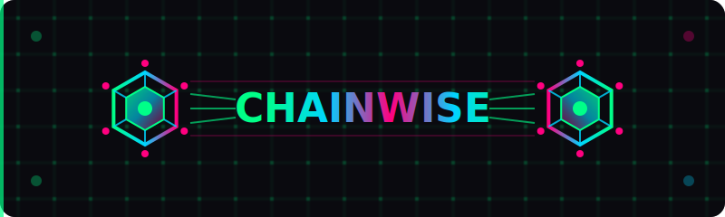

# ChainWise.js

<div align="center">
  


**Private Multi-Blockchain HD Wallet Provider**


[](https://badge.fury.io/js/chainwise)
[](https://opensource.org/licenses/MIT)

</div>

## 🌟 Overview

<b>ChainWise.js</b> is a powerful, fast, multi-blockchain HD wallet library that provides seamless cryptocurrency operations across 17+ blockchain networks. Built with a unified architecture, it eliminates the complexity of managing separate crypto libraries while providing enterprise-grade security and performance.


## 📦 Test Suite Webpage

[https://chainwise.me](https://chainwise.me)


### Developer documentation

[API.md](API.md)


### ✨ Key Features

- 🌐 **17+ Blockchain Networks** - Bitcoin, Ethereum, Solana, Cardano, Polkadot, and more
- 🔐 **HD Wallet Support** - BIP32/BIP44 hierarchical deterministic wallets
- 🚀 **Web Workers** - Non-blocking operations with worker pool management
- 🔒 **Enterprise Security** - AES-256-GCM encryption with PBKDF2 key derivation
- 📱 **Cross-Platform** - Works in browsers, Node.js, and React Native
- ⚡ **High Performance** - Optimized with integrated crypto bundler
- 📦 **Zero Dependencies** - Self-contained with all crypto operations


### 🏗️ Supported Networks

| Tier | Networks | Status |
|------|----------|---------|
| **Tier 1** | Bitcoin, Ethereum, Solana, Cardano, Polkadot, Kusama, Avalanche | ✅ Production |
| **Tier 2** | Binance Smart Chain, Polygon, Cosmos, NEAR, Tron | ✅ Production |
| **Tier 3** | Algorand, Stellar, Ripple, Litecoin, Monero, Filecoin, Nostr | ⚡ Active Development |

## 🚀 Quick Start

### Installation

```bash
# npm
npm install chainwise

# yarn
yarn add chainwise

# pnpm
pnpm add chainwise
```

### CDN Usage

```html
<!-- Production -->
<script src="https://cdn.jsdelivr.net/npm/chainwise@latest/dist/chainwise.min.js"></script>

<!-- Development -->
<script src="https://unpkg.com/chainwise@latest/dist/chainwise.js"></script>
```

### Basic Usage

```javascript
import ChainWise from 'chainwise';

// Initialize the wallet
const wallet = new ChainWise({
    maxWorkers: 4,
    enableLogging: true,
    autoSave: true
});

// Create a new wallet
await wallet.initialize('your-secure-password');

// Get addresses for all supported networks
const addresses = wallet.getAllAddresses();
console.log(addresses);
// {
//   bitcoin: { legacy: '1A1zP1...', segwit: 'bc1qw508d...' },
//   ethereum: '0x742d35Cc...',
//   solana: '9WzDXwBbmkg8...',
//   ...
// }

// Sign a message
const signature = await wallet.signMessage('Hello ChainWise!', 'bitcoin');
console.log(signature);

// Verify the signature
const isValid = await wallet.verifyMessage('Hello ChainWise!', signature);
console.log('Signature valid:', isValid.isValid);
```

## 📖 Core Concepts

### Wallet Lifecycle

```javascript
const wallet = new ChainWise();

// 1. Initialize with password (creates new wallet if none exists)
await wallet.initialize('secure-password');

// 2. Use wallet operations
const addresses = wallet.getAllAddresses();
const signature = await wallet.signMessage('test', 'ethereum');

// 3. Lock when not in use
wallet.lock();

// 4. Unlock when needed
await wallet.unlock('secure-password');

// 5. Clear/destroy when done
await wallet.clearWallet();
wallet.destroy();
```

### Import/Export Operations

```javascript
// Export seed for backup
const seed = wallet.exportSeed();
console.log('Backup this seed:', seed);

// Import from existing seed
await wallet.importSeed('a1b2c3d4e5f6...', 'new-password');

// Export encrypted wallet data
const backup = await wallet.exportWallet('backup-password');

// Import encrypted wallet data
await wallet.importWallet(backup, 'backup-password');
```

## 🎯 Advanced Usage

### Bulk Address Generation

```javascript
// Generate 50 Bitcoin addresses
const addresses = await wallet.generateMultipleAddresses('bitcoin', 50, 0);

addresses.forEach(addr => {
    console.log(`Index ${addr.index}: ${addr.legacy} / ${addr.segwit}`);
});

// Export to CSV
wallet.exportBulkAddresses('bitcoin', addresses);
```

### Multi-Network Operations

```javascript
// Get network configurations
const networks = wallet.getSupportedNetworks();
networks.forEach(network => {
    console.log(`${network.name}: ${network.curve} curve, Tier ${network.tier}`);
});

// Get specific network info
const bitcoinInfo = wallet.getNetworkWalletInfo('bitcoin');
console.log(bitcoinInfo);
// {
//   network: 'Bitcoin',
//   symbol: 'BTC',
//   curve: 'secp256k1',
//   address: { legacy: '...', segwit: '...' },
//   explorer: 'https://blockstream.info'
// }
```

### Performance Monitoring

```javascript
// Get performance metrics
const metrics = wallet.getMetrics();
console.log('Average response time:', metrics.averageResponseTime);
console.log('Success rate:', metrics.successRate);

// Get wallet statistics
const stats = wallet.getWalletStats();
console.log('Total operations:', stats.performance.totalOperations);
console.log('Active workers:', stats.workers.activeWorkers);
```

### Event Handling

```javascript
// Listen for wallet events
window.addEventListener('ChainWise:walletReady', (event) => {
    console.log('Wallet is ready!', event.detail);
});

window.addEventListener('ChainWise:walletLocked', (event) => {
    console.log('Wallet locked for security');
});

window.addEventListener('ChainWise:walletUnlocked', (event) => {
    console.log('Wallet unlocked and ready');
});
```

## 🔧 Configuration Options

```javascript
const wallet = new ChainWise({
    // Worker configuration
    maxWorkers: 4,                    // Max concurrent workers
    workerTimeout: 30000,             // Worker timeout in ms
    
    // Security settings
    autoSave: true,                   // Auto-save to IndexedDB
    enableLogging: true,              // Enable console logging
    
    // Network selection
    defaultNetworks: ['bitcoin', 'ethereum', 'solana'], // Limit networks
    
    // Performance tuning
    maxCacheSize: 1000,               // Max cached operations
    cacheTTL: 300000                  // Cache TTL in ms
});
```

## 🔐 Security Best Practices

### Password Requirements

ChainWise enforces strong password requirements:

```javascript
const validation = wallet.validatePassword('mypassword');
console.log(validation);
// {
//   isValid: false,
//   score: 2,
//   issues: [
//     'Password must contain uppercase letters',
//     'Password must contain numbers',
//     'Password must contain special characters'
//   ]
// }
```

### Secure Storage

- Wallets are encrypted using AES-256-GCM
- Keys derived using PBKDF2 with 100,000 iterations
- Data stored in IndexedDB with encryption at rest
- Memory is cleared after operations

### Backup & Recovery

```javascript
// Always backup your seed phrase securely
const seed = wallet.exportSeed(); // Store this safely offline

// Create encrypted backups
const backup = await wallet.exportWallet('backup-password');
// Store backup in secure location (not on same device)

// Verify backup integrity
const verification = await wallet.importWallet(backup, 'backup-password');
console.log('Backup valid:', verification.success);
```

## 🌍 Browser Compatibility

| Browser | Version | Status |
|---------|---------|--------|
| Chrome | 88+ | ✅ Full Support |
| Firefox | 85+ | ✅ Full Support |
| Safari | 14+ | ✅ Full Support |
| Edge | 88+ | ✅ Full Support |
| Opera | 74+ | ✅ Full Support |
| Mobile Safari | 14+ | ✅ Full Support |
| Chrome Mobile | 88+ | ✅ Full Support |

## 📱 Framework Integration

### React

```jsx
import React, { useEffect, useState } from 'react';
import ChainWise from 'chainwise';

function WalletComponent() {
    const [wallet] = useState(() => new ChainWise());
    const [addresses, setAddresses] = useState({});
    const [isLocked, setIsLocked] = useState(true);

    useEffect(() => {
        const handleWalletReady = () => {
            setAddresses(wallet.getAllAddresses());
            setIsLocked(wallet.isLocked);
        };

        window.addEventListener('ChainWise:walletReady', handleWalletReady);
        window.addEventListener('ChainWise:walletUnlocked', handleWalletReady);
        
        return () => {
            window.removeEventListener('ChainWise:walletReady', handleWalletReady);
            window.removeEventListener('ChainWise:walletUnlocked', handleWalletReady);
            wallet.destroy();
        };
    }, [wallet]);

    const initWallet = async () => {
        await wallet.initialize('secure-password');
    };

    return (
        <div>
            <h2>ChainWise Wallet</h2>
            {isLocked ? (
                <button onClick={initWallet}>Initialize Wallet</button>
            ) : (
                <div>
                    <h3>Your Addresses:</h3>
                    {Object.entries(addresses).map(([network, address]) => (
                        <div key={network}>
                            <strong>{network}:</strong> {typeof address === 'object' ? address.segwit || address.legacy : address}
                        </div>
                    ))}
                </div>
            )}
        </div>
    );
}
```

### Vue.js

```vue
<template>
  <div>
    <h2>ChainWise Wallet</h2>
    <button v-if="isLocked" @click="initWallet">Initialize Wallet</button>
    <div v-else>
      <h3>Your Addresses:</h3>
      <div v-for="(address, network) in addresses" :key="network">
        <strong>{{ network }}:</strong> 
        {{ typeof address === 'object' ? (address.segwit || address.legacy) : address }}
      </div>
    </div>
  </div>
</template>

<script>
import ChainWise from 'chainwise';

export default {
  data() {
    return {
      wallet: new ChainWise(),
      addresses: {},
      isLocked: true
    };
  },
  
  async mounted() {
    window.addEventListener('ChainWise:walletReady', this.handleWalletReady);
    window.addEventListener('ChainWise:walletUnlocked', this.handleWalletReady);
  },
  
  beforeUnmount() {
    window.removeEventListener('ChainWise:walletReady', this.handleWalletReady);
    window.removeEventListener('ChainWise:walletUnlocked', this.handleWalletReady);
    this.wallet.destroy();
  },
  
  methods: {
    async initWallet() {
      await this.wallet.initialize('secure-password');
    },
    
    handleWalletReady() {
      this.addresses = this.wallet.getAllAddresses();
      this.isLocked = this.wallet.isLocked;
    }
  }
};
</script>
```

### Node.js

```javascript
const ChainWise = require('chainwise');

// Node.js usage
const wallet = new ChainWise({
    maxWorkers: 2, // Fewer workers in Node.js
    enableLogging: false // Disable browser-specific logging
});

async function main() {
    await wallet.initialize('server-password');
    
    const addresses = wallet.getAllAddresses();
    console.log('Generated addresses:', addresses);
    
    // Sign a transaction
    const signature = await wallet.signMessage('server-message', 'bitcoin');
    console.log('Signature:', signature);
    
    wallet.destroy();
}

main().catch(console.error);
```

## 🔍 Error Handling

```javascript
try {
    await wallet.initialize('password');
} catch (error) {
    if (error.message.includes('Password validation failed')) {
        console.log('Please use a stronger password');
    } else if (error.message.includes('Invalid seed')) {
        console.log('The provided seed is invalid');
    } else {
        console.error('Wallet error:', error.message);
    }
}

// Handle worker errors
wallet.on('workerError', (error) => {
    console.error('Worker failed:', error);
    // Implement fallback or retry logic
});
```

## 📊 Performance Tips

### Optimization

```javascript
// Pre-initialize for better performance
const wallet = new ChainWise({
    maxWorkers: 8, // Use more workers for better parallel processing
    defaultNetworks: ['bitcoin', 'ethereum'], // Limit to needed networks
});

// Batch operations when possible
const operations = await Promise.all([
    wallet.generateMultipleAddresses('bitcoin', 10),
    wallet.generateMultipleAddresses('ethereum', 10),
    wallet.signMessage('message1', 'bitcoin'),
    wallet.signMessage('message2', 'ethereum')
]);

// Use caching for repeated operations
const cachedAddresses = wallet.getAllAddresses(); // Cached after first call
```

### Memory Management

```javascript
// Clean up resources
wallet.destroy(); // Terminates workers and clears memory

// Monitor memory usage
const stats = wallet.getWalletStats();
console.log('Memory usage:', stats.workers);

// Clear caches periodically
wallet.clearCache(); // If available in your version
```

## 🚨 Common Issues & Solutions

### Worker Initialization Failures

```javascript
// Check if Web Workers are supported
if (typeof Worker === 'undefined') {
    console.warn('Web Workers not supported, using main thread');
    const wallet = new ChainWise({ maxWorkers: 0 }); // Disable workers
}
```

### Network-Specific Issues

```javascript
// Check network support before operations
const supportedNetworks = wallet.getSupportedNetworks();
const isNetworkSupported = supportedNetworks.some(n => n.key === 'bitcoin' && n.isSupported);

if (!isNetworkSupported) {
    throw new Error('Bitcoin network not supported in this version');
}
```

### Storage Issues

```javascript
// Handle storage quota exceeded
try {
    await wallet.initialize('password');
} catch (error) {
    if (error.message.includes('storage')) {
        // Clear old data or ask user to free space
        await wallet.clearWallet();
    }
}
```

## 📄 License

MIT License - see the [LICENSE](LICENSE) file for details.


<div align="center">
  <p><strong>Built with ❤️ by Omodaka9375</strong></p>
  <p>Making multi-blockchain development simple and secure</p>
</div>


